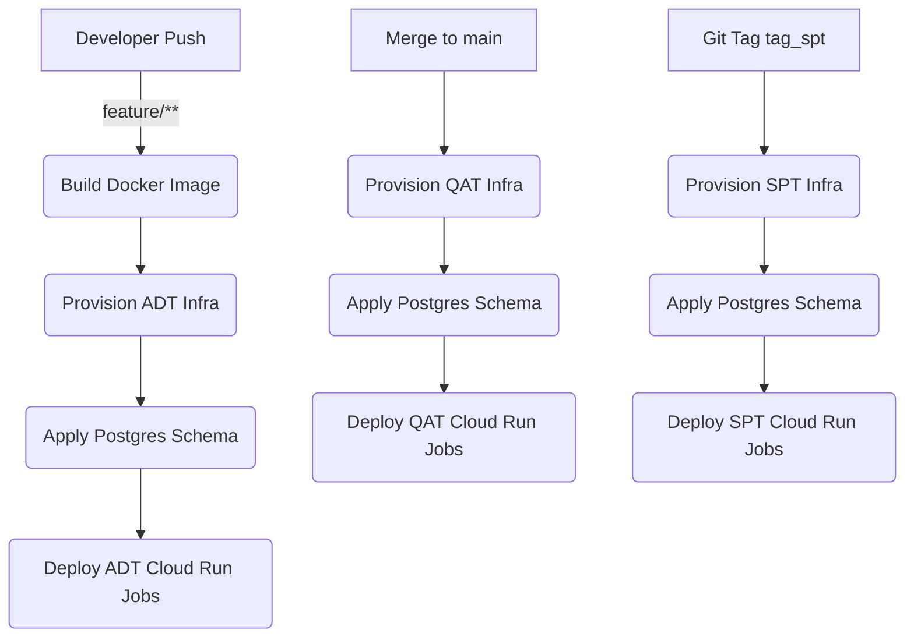

# GitHub Actions Workflows Overview
# CI/CD Pipeline Documentation: Costco Lead Management

This repository uses GitHub Actions to automate infrastructure provisioning, schema updates, container builds, and job deployments for multiple GCP environments (`adt`, `qat`, `spt`).
This repository leverages GitHub Actions and Terraform to automate the infrastructure provisioning, database schema management, and application deployment for the Costco Lead Management system across multiple Google Cloud Platform (GCP) environments.

---

## Workflow Summary
## 1. Pipeline Architecture Overview

| Workflow                        | Purpose                          | Environments         | Triggered On                                  | Tools Used                    |
|--------------------------------|----------------------------------|----------------------|-----------------------------------------------|-------------------------------|
| `lead_mgmt_image.yml`          | Build & push container image     | All                  | Push to `feature/**`                          | Docker, GitHub & GCP Registry |
| `provision_adt.yml`            | Provision infrastructure         | `adt`                | Push/PR to `feature/**`                       | Terraform                     |
| `provision_adt_schema.yml`     | Apply PostgreSQL schema          | `adt`, `qat`, `spt`  | Push/PR to `feature/**`                       | Terraform, Cloud SQL Proxy    |
| `provision_qat.yml`            | Provision infrastructure         | `qat`                | Push/PR to `main`                             | Terraform                     |
| `provision_spt.yml`            | Provision infrastructure         | `spt`                | Git tag `tag_spt`                             | Terraform                     |
| `snow_sync_job_deployment.yml`| Deploy Cloud Run Snow Sync Job   | `adt`, `qat`, `spt`  | Push to `main`, `feature/**`, or tag `tag_*`  | Cloud Run, Scheduler          |
| `lead_match_job_deployment.yml`| Deploy Lead Match Cloud Run Job | `adt`, `qat`, `spt`  | Triggered by `workflow_call`                 | Cloud Run                     |
The CI/CD flow follows a "Branch-to-Environment" strategy, ensuring that code is validated in development before moving to testing and staging.

### Deployment Flow
1.  **Development (`adt`)**: Triggered by pushes to `feature/**` branches. Used for active development and automated unit/integration testing.
2.  **Quality Assurance (`qat`)**: Triggered by merges into the `main` branch. Used for stable testing and QA sign-off.
3.  **Staging/Pre-Prod (`spt`)**: Triggered by Git tags (e.g., `tag_spt`). Used for final validation before production.

### High-Level Flow Diagram

---

##  Workflow Details
## 2. Infrastructure as Code (Terraform)

###  1. `lead_mgmt_image.yml`
Builds and pushes a Docker image used in lead management jobs.
Infrastructure is managed using Terraform to ensure consistency across environments.

**Trigger Conditions:**
- Push to `feature/**`
- Path changes in:
  - `.github/workflows/lead_mgmt_image.yml`
  - `lead_management_job/**`
  - `lead_match_codebase/**`
### Directory Structure
-   `terraform/modules/`: Reusable components (Cloud Run, Cloud SQL, IAM, Scheduler).
-   `terraform/environments/{env}/infra/`: Environment-specific configurations for core resources.
-   `terraform/environments/{env}/schema/`: PostgreSQL schema management using the Terraform Postgres provider.

**Main Actions:**
- Builds a Python wheel from `lead_match_codebase`
- Injects it into a Docker container
- Pushes image to:
  - GitHub Container Registry (`ghcr.io`)
  - Google Artifact Registry
- Triggers:
  - `lead_match_job_deployment.yml`
  - `snow_sync_job_deployment.yml`
### Key Practices
-   **State Management**: Terraform state is stored in a remote GCS bucket per environment to enable collaboration and locking.
-   **Authentication**: The pipeline uses **GCP Workload Identity Federation (WIF)** to authenticate GitHub Actions to GCP without long-lived service account keys.
-   **Cloud SQL Access**: Schema updates are performed via the `Cloud SQL Auth Proxy`, allowing the runner to securely connect to private database instances.

---

###  2. `provision_adt.yml`
Provisions cloud infrastructure for the `adt` environment.
## 3. Workflow Catalog

**Triggered By:**
- Push or pull request to `feature/**`
- Changes in:
  - `terraform/environments/adt/infra/**`
  - `terraform/modules/**`
  - `.github/workflows/provision_adt.yml`
| Workflow                        | Purpose                          | Environments         | Triggered On                                  | Tools Used                    |
|--------------------------------|----------------------------------|----------------------|-----------------------------------------------|-------------------------------|
| `lead_mgmt_image.yml`          | Build & push container image     | All                  | Push to `feature/**`                          | Docker, GitHub & GCP Registry |
| `provision_adt.yml`            | Provision infrastructure         | `adt`                | Push/PR to `feature/**`                       | Terraform                     |
| `provision_adt_schema.yml`     | Apply PostgreSQL schema          | `adt`                | Push/PR to `feature/**`                       | Terraform, Cloud SQL Proxy    |
| `provision_qat.yml`            | Provision infrastructure         | `qat`                | Push/PR to `main`                             | Terraform                     |
| `provision_spt.yml`            | Provision infrastructure         | `spt`                | Git tag `tag_spt`                             | Terraform                     |
| `snow_sync_job_deployment.yml`| Deploy Snowflake Sync Job        | `adt`, `qat`, `spt`  | Push to `main`, `feature/**`, or tag `tag_*`  | Cloud Run, Cloud Scheduler    |
| `lead_match_job_deployment.yml`| Deploy Lead Match Job            | `adt`, `qat`, `spt`  | `workflow_call` from Image Build             | Cloud Run                     |

**Highlights:**
- Authenticates using Workload Identity
- Initializes and applies Terraform

---

###  3. `provision_adt_schema.yml`
Applies schema changes to PostgreSQL using Cloud SQL Auth Proxy.
## 4. Detailed Workflow Explanations

**Triggered By:**
- Push or pull request to `feature/**`
- Changes in:
  - `terraform/environments/adt/schema/**`
  - `postgres_resources/**.sql`
  - `.github/workflows/provision_adt_schema.yml`
### CI: Containerization (`lead_mgmt_image.yml`)
This workflow ensures that the latest code is packaged and available for deployment.
1.  **Build**: Creates a Python wheel from the `lead_match_codebase`.
2.  **Package**: Injects the wheel into a Docker image.
3.  **Distribute**: Pushes the image to **GHCR** (for GitHub internal use) and **Google Artifact Registry** (for GCP deployment).
4.  **Chain**: Automatically triggers the deployment workflows for `Lead Match` and `Snow Sync`.

**Steps:**
- Authenticates to GCP
- Starts Cloud SQL Proxy
- Executes SQL with `psql`
- Applies Terraform schema definitions
### CD: Infrastructure Provisioning (`provision_*.yml`)
There are environment-specific provisioning workflows (ADT, QAT, SPT).
-   **Validation**: Runs `terraform plan` to show changes before application.
-   **Application**: Runs `terraform apply` to update the actual cloud environment.
-   **Schema Management**: The `provision_adt_schema.yml` is unique as it handles the database layer. It uses `psql` and Terraform to apply DDL/DML changes found in `postgres_resources/`.

---
### CD: Application Deployment (`*_job_deployment.yml`)
These workflows deploy the logic to **Cloud Run Jobs**.
-   **Dynamic Environment Detection**: Workflows inspect the Git branch/tag to determine which GCP project and Service Account to use.
-   **Scheduling**: For the `Snow Sync` job, the workflow also configures **Cloud Scheduler** to trigger the job on a defined cron frequency.

###  4. `provision_qat.yml`
Provisions infrastructure in the `qat` environment.

**Triggered By:**
- Push or PR to `main`
- Changes in:
  - `terraform/environments/qat/infra/**`
  - `terraform/modules/**`
  - `.github/workflows/provision_qat.yml`

**Details:**
- Uses Terraform for environment provisioning
- Uses matrix strategy for future scalability

---

###  5. `provision_spt.yml`
Provisions `spt` infrastructure using Git tags.
## 5. Setup and Configuration

**Triggered By:**
- Git tag `tag_spt`
- Path changes in:
  - `terraform/environments/adt/infra/**`
  - `terraform/modules/**`
  - `.github/workflows/provision_adt.yml`
### Prerequisites
1.  **GCP Setup**: Enable Artifact Registry, Cloud Run, Cloud SQL, and Cloud Scheduler APIs.
2.  **Workload Identity Federation**: Configure a WIF Pool and Provider in GCP to allow GitHub Actions to assume identities.
3.  **IAM**: Ensure the GitHub Service Account has `roles/editor` and `roles/iam.workloadIdentityUser`.

**Highlights:**
- Used for staging deployments
- Terraform `init`, `plan`, and `apply`
### Required GitHub Secrets
The following secrets must be configured in the repository settings:

---
| Secret Name             | Description                                           |
|-------------------------|-------------------------------------------------------|
| `WIF_PROVIDER`          | The full path to the GCP WIF Provider                 |
| `WIF_SERVICE_ACCOUNT`   | The email of the service account for WIF              |
| `GCP_PROJECT_ID_ADT`    | GCP Project ID for the ADT environment                |
| `GCP_PROJECT_ID_QAT`    | GCP Project ID for the QAT environment                |
| `GCP_PROJECT_ID_SPT`    | GCP Project ID for the SPT environment                |
| `GH_TOKEN`              | Personal Access Token for GitHub Container Registry   |

###  6. `snow_sync_job_deployment.yml`
Deploys the Cloud Run job for Snowflake sync.

**Triggered By:**
- `workflow_call` from another workflow
- Push to:
  - `main`
  - `feature/**`
  - Git tags: `tag_spt`, `tag_prod`

**Features:**
- Detects environment (`adt`, `qat`, or `spt`) dynamically
- Uses Cloud Run Jobs + GCP Scheduler
- Authenticates with Workload Identity
- Deploys and schedules the job

---

###  7. `lead_match_job_deployment.yml`
Deploys the Lead Match Cloud Run job.
## 6. Developer Guidelines

**Triggered By:**
- `workflow_call` from `lead_mgmt_image.yml`
### Making Infrastructure Changes
1.  Modify the relevant files in `terraform/modules/` or `terraform/environments/`.
2.  Push to a `feature/**` branch.
3.  Review the `Terraform Plan` output in the GitHub Action logs for `provision_adt`.
4.  Once merged to `main`, the changes will propagate to `qat`.

**Features:**
- Reads container from Artifact Registry
- Deploys Cloud Run job
- Configurable via input parameters
### Updating Database Schema
1.  Add new `.sql` files to `postgres_resources/`.
2.  Update the Terraform schema resources in `terraform/environments/adt/schema/`.
3.  The `provision_adt_schema` workflow will handle the Cloud SQL Proxy connection and apply the changes.

---

##  Notes

- **Environment Detection:** Some workflows determine the environment dynamically based on Git refs (branches or tags).
- **Service Accounts:** Each environment has its dedicated GCP Workload Identity service account.
- **Reusable Workflows:** `workflow_call` is used for triggering job deployments programmatically.
### Troubleshooting
-   **Identity Errors**: Verify that the `WIF_PROVIDER` is correct and that the service account has the "Workload Identity User" role assigned to the GitHub repository.
-   **Terraform Locks**: If a workflow crashes, you may need to manually release the state lock in the GCS bucket.
