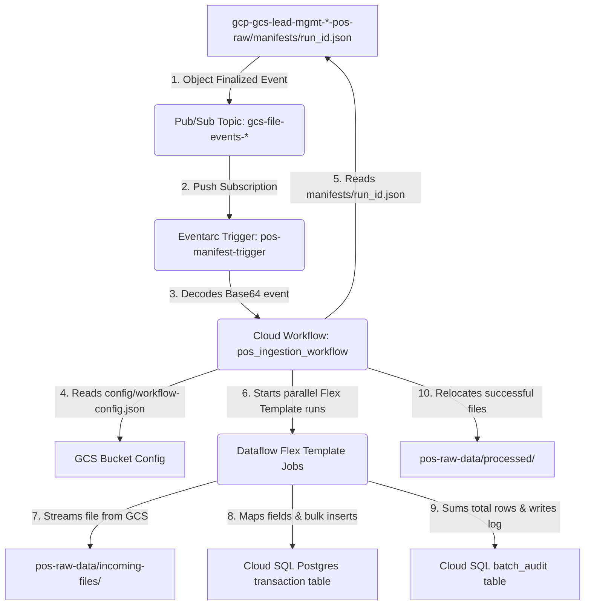

# Google Cloud Storage to PostgreSQL Downstream Ingestion: Eventarc, Workflows, & Dataflow Analysis

This document details the highly automated, decoupled ingestion engine that operates downstream of the **`drive_to_gcs_sync`** workflow.

---

## 1. Downstream Decoupled Architecture

The following Mermaid diagram outlines how GCS manifest uploads act as the trigger-boundary to run scalable, private-IP Apache Beam ingestion pipelines:



---

## 2. Eventarc Trigger & Topic Details

The event trigger boundary is built to be secure, resilient, and event-driven:

*   **Watch Target**: Pub/Sub Topic `gcs-file-events-${var.environment}` linked to the POS raw GCS bucket (`gcp-gcs-lead-mgmt-us-${environment}-pos-raw`).
*   **Decoupled Prefix Filter**: The GCS-to-Pub/Sub notifications are specifically filtered to watch **`manifests/`** (using the Terraform parameter `folder_prefix = "manifests/"`).
*   **Why manifests instead of incoming files?**: This is a critical safety control. If the trigger watched `pos-raw-data/incoming-files/`, a sync job transferring 20 spreadsheets would trigger 20 independent workflows and 20 simultaneous Dataflow clusters instantly, causing connection starvation and database CPU exhaustion. Listening *exclusively* to `manifests/` guarantees that the ingestion only fires when the entire batch is fully transferred and archived.

---

## 3. Cloud Workflow: `pos_ingestion_workflow`

When the Eventarc trigger catches a Pub/Sub message, it launches `pos_ingestion_workflow`.

### Step-by-Step Execution Sequence

1.  **Event Initialization**: The workflow extracts the Base64 data from the Pub/Sub message (`event.data.message.data`), decodes it, and parses the GCS payload to resolve the target bucket name and manifest object path.
2.  **Configuration Reading**: It reads the environment configuration JSON dynamically from GCS at `gs://<bucket>/config/workflow-config.json`. This config contains machine specifications, database schemas, subnet mappings, and downstream trigger workflows.
3.  **Path Validation**: A defensive regex step verifies that the uploaded GCS object path ends with `.json` under the `manifests/` prefix.
4.  **Manifest Processing**: Reads `manifests/<run_id>.json` from GCS to retrieve `run_id` and the array of absolute files paths under `manifest.files`.
5.  **Checkpoint Evaluation**: Reads `state/<run_id>.json` to check if this is a resumed execution (restarting from stages like `dataflow_done` or `moved`), enabling crash recovery.
6.  **Programmatic Dataflow Launch**: It iterates through the files list in parallel, launching individual Google Cloud Dataflow Flex Template jobs via:
    `googleapis.dataflow.v1b3.projects.locations.flexTemplates.launch`
7.  **Dataflow Job Polling**: The workflow polls the Dataflow API until the state reaches `JOB_STATE_DONE` or `JOB_STATE_FAILED`.
8.  **File Archiving & Cleanup**: Moves successfully processed files from `pos-raw-data/incoming-files/` to `pos-raw-data/processed/` dynamically.
9.  **Downstream Propagation**: On 100% ingestion success, it launches the next downstream workflow (`snow_sync_workflow`).

---

## 4. Google Cloud Dataflow Ingestion Deep Dive

Dataflow runs an Apache Beam pipeline packaged as a Google-registered Flex Template (`pos-pipeline-flex-<env>.json`).

### Job Inputs and Mapping Variables

The Cloud Workflow injects the following parameter arguments dynamically:
*   `input_file`: The GCS path (e.g., `gs://<bucket>/pos-raw-data/incoming-files/raw_file.xlsx`).
*   `instance_connection_name`: Resolved from config (e.g., `p-601-np-bcleadsmgmt-adt:us-central1:lead-mgmt-adt`).
*   `db_name`, `db_schema`, `db_table`, `db_user`: Target Postgres settings.
*   `field_map_path`: Path to `gs://<bucket>/config/field_map.json`.
*   `batch_id`: A unique run ID generated via `uuid.generate()` in the workflow.

### Private Network Isolation & Database IAM Authentication

To meet stringent enterprise security, Dataflow workers are completely isolated:
*   **No Public IPs**: Workers are configured with `ipConfiguration: WORKER_IP_PRIVATE` and compute on a private subnetwork (`gcp-snt-np-usc1-601-cloudrunjobs-np`).
*   **Password-less Connection**: The Python Beam code initializes the **GCP Cloud SQL Python Connector** (`pg8000`) with `enable_iam_auth=True` and `ip_type=IPTypes.PRIVATE`. The database authenticates using the runner's Workload Identity service account.
*   **Confidential Computing**: The job environment specifies `"enable_confidential_compute"` as an active experiment to encrypt worker memory.

---

## 5. Audit Logging & SQL Verification

### Logging Behavior
*   **Row Ingestion Logs**: Workers yield processed row counts, collapsing them down into one combined sum via `CombineGlobally(sum)`.
*   **`batch_audit` Insertion**: The pipeline writes a single consolidated audit row to the target PostgreSQL `batch_audit` table upon completion to track throughput and timing.

### CLI & SQL Verification Scripts

To monitor execution and confirm database ingestion, use the following procedures:

#### A. Trace Active Dataflow Jobs
```bash
# List all recent Dataflow jobs in the target region
gcloud dataflow jobs list \
  --region="us-central1" \
  --project="p-601-np-bcleadsmgmt-adt" \
  --limit=10
```

#### B. Check Ingestion Progress inside GCS State Checkpoints
```bash
# Read the current execution checkpoint state
gcloud storage cat "gs://gcp-gcs-lead-mgmt-us-adt-pos-raw/state/<run_id>.json" \
  --project="p-601-np-bcleadsmgmt-adt"
```

#### C. Database SQL Verification Queries
Connect to your Cloud SQL PostgreSQL instance and run the following queries to verify records:

```sql
-- 1. Check batch audit log status
SELECT * 
FROM lead_mgmt_adt.batch_audit 
ORDER BY start_date DESC 
LIMIT 5;

-- 2. Confirm transaction rows were successfully loaded for this batch
SELECT COUNT(*), batch_id 
FROM lead_mgmt_adt.transaction 
GROUP BY batch_id 
ORDER BY COUNT(*) DESC 
LIMIT 5;

-- 3. Isolate loaded transactions using the manifest run_id
-- (Note: 'comments' in batch_audit contains the manifest_run_id as a JSON field)
SELECT COUNT(*) 
FROM lead_mgmt_adt.transaction 
WHERE batch_id IN (
    SELECT batch_id 
    FROM lead_mgmt_adt.batch_audit 
    WHERE comments LIKE '%"manifest_run_id": "run-20260618-120000"%'
);
```

---

## 6. Downstream Troubleshooting Checklist

If files land in GCS but database tables remain empty, check the following steps:

1.  **Verify Eventarc Trigger State**:
    Ensure the Eventarc trigger `pos-manifest-trigger` exists and is active:
    ```bash
    gcloud eventarc triggers describe pos-manifest-trigger \
      --location="us-central1" --project="p-601-np-bcleadsmgmt-adt"
    ```
2.  **Verify Cloud Workflow Execution logs**:
    Check the execution history of `pos_ingestion_workflow` inside GCP Console to find failures.
3.  **Confirm configuration files are placed correctly**:
    Dataflow jobs will fail instantly if configurations do not exist inside GCS. Ensure they are in place:
    ```bash
    gcloud storage ls "gs://gcp-gcs-lead-mgmt-us-adt-pos-raw/config/" \
      --project="p-601-np-bcleadsmgmt-adt"
    ```
4.  **Inspect Dataflow Worker Logging**:
    If a Dataflow job is marked as `FAILED`, go to **Dataflow** -> click your job -> select **Logs** tab -> change logging severity to **Error** to locate the exact python traceback (such as connection timeouts or IAM authorization failures).
